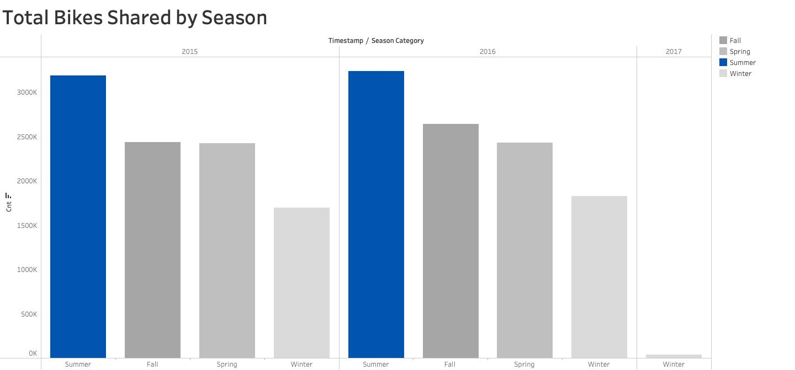
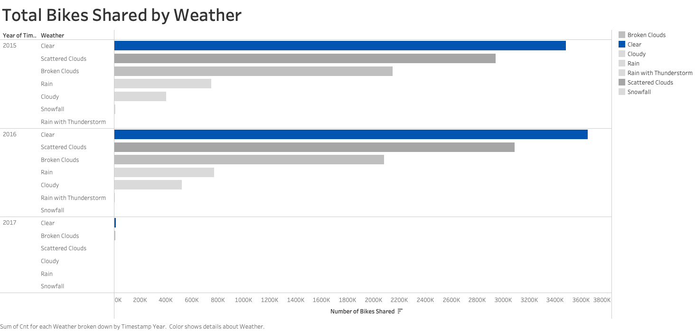
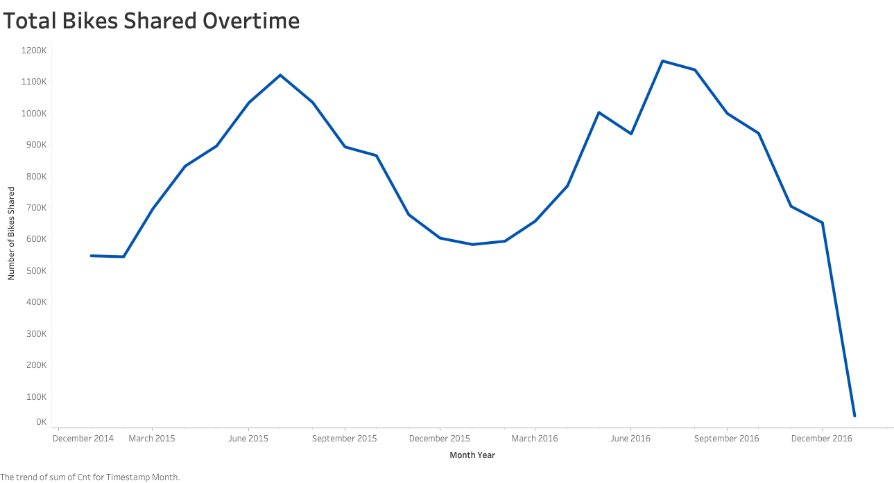

# Demand for Electric Bicycles Analysis

Yulu is India’s leading micro-mobility service provider, which offers unique vehicles for the daily commute. Starting off as a mission to eliminate traffic congestion in India, Yulu provides the safest commute solution through a user-friendly mobile app to enable shared, solo and sustainable commuting. Yulu zones are located at all the appropriate locations (including metro stations, bus stands, office spaces, residential areas, corporate offices, etc) to make those first and last miles smooth, affordable, and convenient.

## Project Description

Yulu has recently suffered considerable dips in its revenues. They have contracted a consulting company to understand the factors on which the demand for these shared electric bicycles depends. Specifically, they want to understand the factors affecting the demand for these shared electric bicycles in the Indian market.

The company wants to know:

* Which variables are significant in predicting the demand for shared electric bicycles in the Indian market?
* How well do those variables describe the electric bicycle demand.

## Findings

#### How the number of bikes changes in each season

There were more bikes shared during Summer than there were in the other seasons. On the other hand, people use less bikes during Winter.

 

#### How the number of bikes changes in each weather

People tend to use and share bikes when the weather is clear and less when the weather is extreme.

 

#### How the number of bikes shared overtime

This graph gives more information on the effect of the weather and season on the number of bikes used.

 

#### Which variables are significant in predicting the demand for shared electric bicycles in the Indian market?

The top variables with a significant impact in predicting the demand for shared electric bicycles in the Indian market are the **temperature**, the **time of season**, and the **weather condition**. For every increase in temperature, there is an increase of 97.7298 bikes that are been shared, holding everything else constant. This also shows that when temperature warmer people tend to bike more than in a colder temperature. For every Summer and Spring seasons, the number of bike shared decreases by 200.6393 and 112.8692 respectively compared to Fall. In the Winter, the number of bike shared increases by 14.2068 compared to Fall. 

#### How well do those variables describe the electric bicycle demand.

29.1% of the data is explained by these variables

